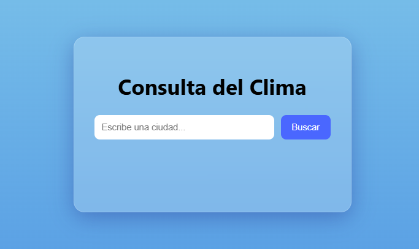
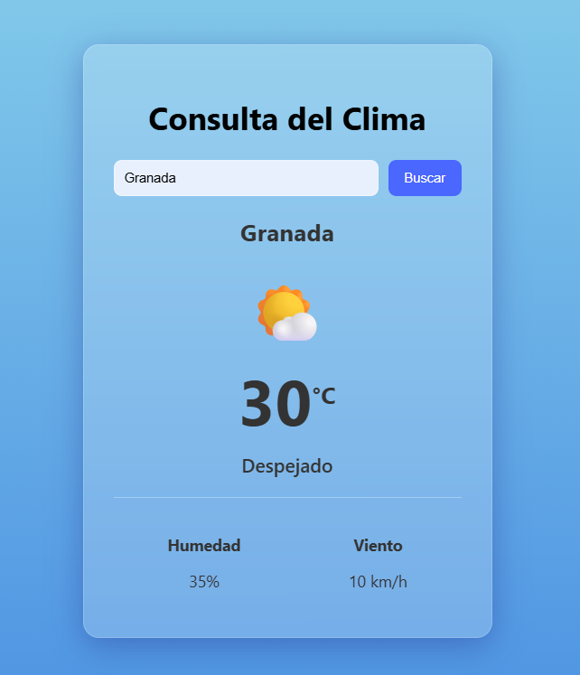

# APP_TIEMPO

**APP_TIEMPO** es una aplicación web de una sola página, elegante y moderna, que permite a los usuarios consultar la información del clima para una lista predefinida de ciudades. La aplicación destaca por su interfaz de usuario con efecto de "cristal esmerilado" (glassmorphism) y animaciones suaves.

## 🚀 Características Principales

- **Interfaz Moderna**: Diseño limpio con un efecto de cristal semitransparente (`glassmorphism`) que se superpone a un fondo degradado.
- **Búsqueda Local**: Consulta la información del clima de ciudades almacenadas en un archivo `ciudades.json` local.
- **Experiencia de Usuario Fluida**:
  - Los resultados aparecen con una sutil animación de fundido y deslizamiento.
  - Permite realizar búsquedas tanto con el botón "Buscar" como presionando la tecla "Enter".
- **Manejo de Errores**: Muestra mensajes claros si el usuario no introduce texto o si la ciudad buscada no se encuentra en la base de datos.
- **Estructura Semántica y Accesible**: El HTML está construido con etiquetas semánticas (`<main>`, `<section>`) y considera la accesibilidad (uso de `<label>` y atributos `aria-live`).

## 🛠️ Tecnologías Utilizadas

La aplicación está construida enteramente con tecnologías web estándar, sin necesidad de frameworks complejos.

- **HTML5**:
  - Estructura semántica para una mejor organización y accesibilidad.
  - Atributos `aria-live` para informar a los lectores de pantalla sobre cambios dinámicos.
- **CSS3**:
  - **Flexbox** para centrar y alinear el contenido.
  - **`backdrop-filter`** para lograr el efecto de desenfoque del fondo (glassmorphism).
  - **Transiciones y Animaciones** para una experiencia de usuario más agradable.
  - Diseño responsivo básico gracias al uso de unidades relativas y Flexbox.
- **JavaScript (ES6+)**:
  - **`async/await`** con la API `Fetch` para cargar los datos del archivo `ciudades.json` de forma asíncrona.
  - Manipulación del **DOM** para mostrar dinámicamente los resultados del clima.
  - **Manejo de eventos** para la interactividad del usuario (clics y pulsaciones de teclas).

## ⚙️ ¿Cómo funciona?

1.  El usuario introduce el nombre de una ciudad en el campo de búsqueda.
2.  Al hacer clic en "Buscar" o presionar "Enter", JavaScript se activa.
3.  La aplicación carga de forma asíncrona los datos del archivo `ciudades.json`.
4.  Busca una coincidencia (insensible a mayúsculas/minúsculas) en la lista de ciudades cargadas.
5.  Si encuentra la ciudad, genera dinámicamente el HTML con los datos del clima (temperatura, estado, humedad, etc.) y lo muestra con una animación.
6.  Si no la encuentra, muestra un mensaje de error.